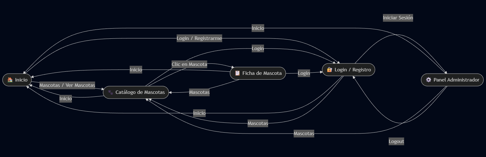

# Plataforma para la gestión de adopción y cuidado de mascotas
Proyecto académico desarrollado para la materia Análisis y Diseño de Sistemas.

## Fases del proyecto
- ## Documentación
- [Actividad 1 – Identificación del proyecto](Documentacion/Actividad1_Identificar_Proyecto.pdf.pdf)
- 📌 **Mapa de interés e influencia:** <[Mapa Interes](https://www.canva.com/design/DAG01m3UXJg/41jSDtNOKFAuciJnx1CH5w/view?utm_content=DAG01m3UXJg&utm_campaign=designshare&utm_medium=link2&utm_source=uniquelinks&utlId=h33c54577d7)>
  
- ⚠️ **Matriz de riesgos:**  
  
- 🔁 **Diagrama(s) de flujo (Actividad 1):**  <[Diagrama](https://www.mermaidchart.com/play?utm_source=mermaid_live_editor&utm_medium=toggle#pako:eNpdlM-O0zAQh19llNMiVO32L6IH0CpsJKRdDg3qhXKYddxi5NjBdsqW1T4MD7AnblyQ6IsxttPG4ZrM2J-_-dmPGdMVz5bZaDTaKKbVVuyWGwUg8aBbt4SteODVRoXfW6m_sy9oHNyufA3A9dXFp032Xgkm9Cb7_AJGozdwPaZvNw-N1AYN1GiZdmjpd9czpiooueSMuhSVhKbJ4yb7--cuVkMlbKOVuJf87SZ76honvvGD7jZJP5bH5_h1Slvfcm7A8G-tsMJpCwc6BGH3ANNYO6PaXNeN5I4gttrUrUQjNFQcsNINE8dfqu-axa554Cz66v3xpxSVTjjnkXMJTBvDd6I74Sz9fSIuvKwV3xMr7QaN4VLUwlshComwbVWFQ5JiHDujsbz1JwBmhOOEY-H--NMKpm0PVKTiVuOLsCMZ-aHhEmy7oz4D2hk8DcuPMrauxgPbxcB24W2XWtL0vcFKs7bmipT3qFF1MQuo784FZCZ4H1DOUsqJpyzbe5GuC1uUDpXjNiGcdCzpKmfCuY-icsYLplgJn1SUPd88li2iSq2cUMffmEAtUqiph7oNK9F0uG04ObuM6vq8nMCmQ3WLFGztx772AaWldE1UUlCa-pCuo_h1HHJXadEJu0XmNJX2kOvBfGce8o5_pdtnwzWg8VaYGpt1CGn3GWw6yOOe-1Qpj-azuU8J4_nWcbYlyrYCbFzKNZjo3HN9NOiwFn6aJC4aNAnavINIFzih5eNwYWmaSN2HkCFD7mwSuDxqy6O2QpgaqS629GD5QNjCg-WoGJd07aHRJlz_ELQeLR9ougm3KCRrh2TZv1YW6bmCl9BIVD4frCXvlU7M30S60h-k5LtWdCZeXU6vLl9fQXV8Th7KsquOZ0nr0xwkxyoHD6TVHvG60QdN5xHhrZUk3XBetQz_SyuVd2zpWud7JFRY7PQqnu4vVt1bkT39A7SX9YI)>
  

- Diseño y prototipado (Actividad 2)

## 🧱 Prototipos de Baja Fidelidad 
- 🌐 **Prototipo (WireFrame):** <[WIREFRAME](https://wireframe.cc/pro/ppp/fa9342c16-989960)>
Representan la estructura sin estilos visuales.

- 🏠 Inicio  
  
- 🐾 Catálogo de mascotas  
  
- 📋 Ficha de mascota  
  
- 🔐 Login / Registro  
  
- ⚙️ Panel administrativo  
  

### 💎 Prototipos – Alta fidelidad (Figma)
- 🌐 **Prototipo navegable (Figma):** <[FIGMA](https://www.figma.com/design/SvMxgvIB6WlYhpQo64TOoU/Prototipo-Alta-Fidelidad-%E2%80%93-Adopci%C3%B3n-de-Mascotas?node-id=1-4&t=O96D6RW3sQh6Y8JB-1)>
- Capturas:
  - 
  - 
  - 
  - 
  - 
 
    ### 🧭 Site Map (Mapa de Navegación) <[SiteMapa](https://mermaid.live/edit#pako:eNqFk0Fv0zAUx7_Kk6VJQ-pKmqZNiTSk1MkgUttUzYQQCwcr8VKLxq5cVxo0PXDmsEnbBS7AZ-DCiUu_CV8APgKJS7vSSTQHy37v-f_7v8hvgRKRUuSgTJLpGHqjmB8dAXhM0iRhq2_cKWNwCj16qUAJGLFsrGKuq071B4PQCyMYjoIBDoZuz4_-JmLuHl_8_nz9BQLOEiZeP4p5t4rc_ABM1OrrRGQCUgp9MkuEIrOqAFcFtx_gjCVjspOscl6Vu7uBnsgYh8cwohmbKamF_eOLn58-_vp-DUPC6QTcNGe8ypJUyKpg1zEOB_7LoFwi8PzI8yEYBDgI733DycnTYmOrJL2gcuuygO6mYs8IkTktwDvAwu756n0vfHaP62qx9U8qwN0EtLrWW5_xhCVA-cZIAfgA6SzAz91yD303wuG5uwXifSD-p2HdId7z8F9S2U4w2Mp7-_LeQ_mdGiIhorPqrRXgHwC5Xn8H5O-D_Icgf9OHmCvdCKqVb52lyLkkkxmtoZzKnFRntIg5QIzUmOY0Rk65TYl8E6OYL8tLU8JfCZEjR8l5eU2KeTbeisynKVHUY6Qco3wblZSnVGIx5wo5pm1pEeQs0BVyGoZd77Qt-0mz1Wo2LKNp1tBb5LTNutUxGw3DsJqW3bbayxp6p7FG3bYty7AaRqdlWk3TLOVoypSQ_fUE60Fe_gEDgzMu)>
- 🖼️ Imagen:  
  

## Creado por
- William Javier Amaya Castaño
