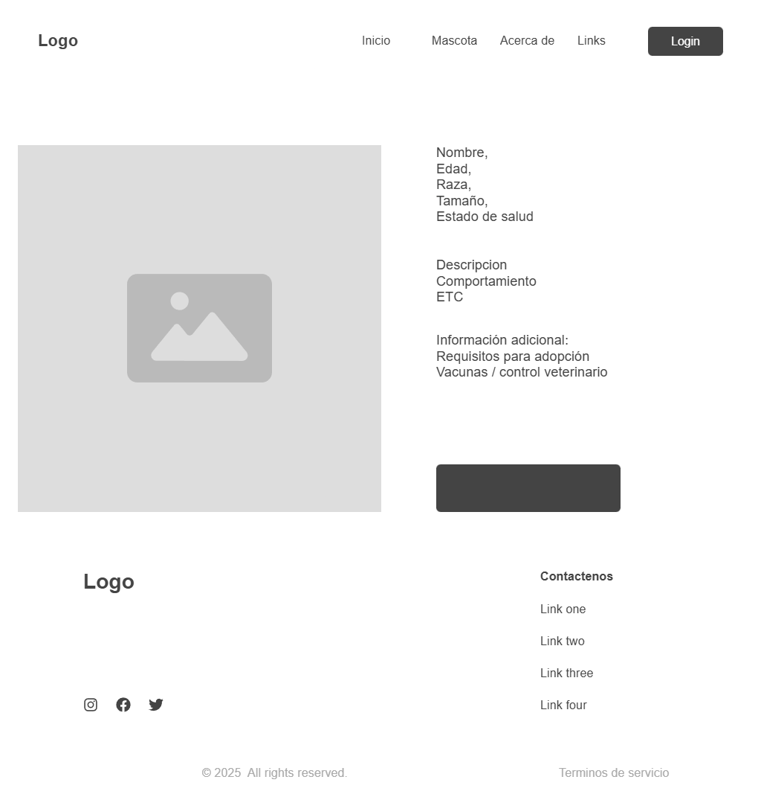
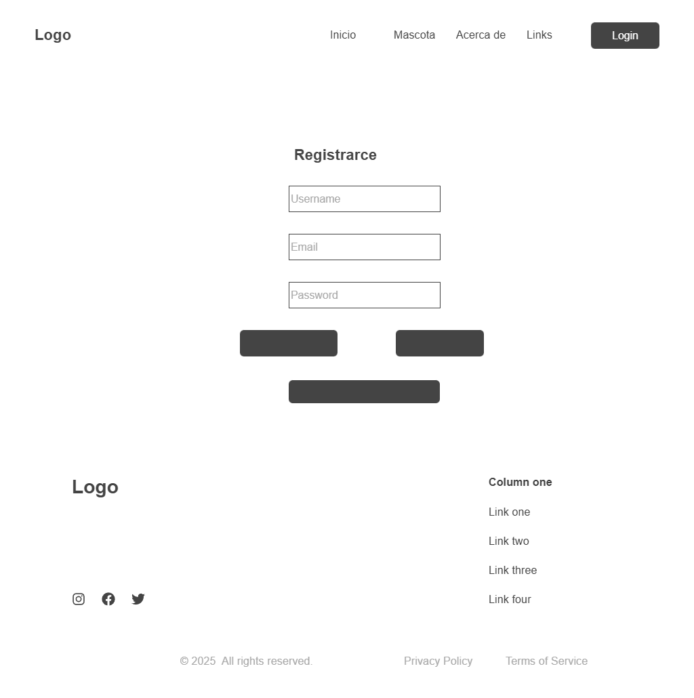
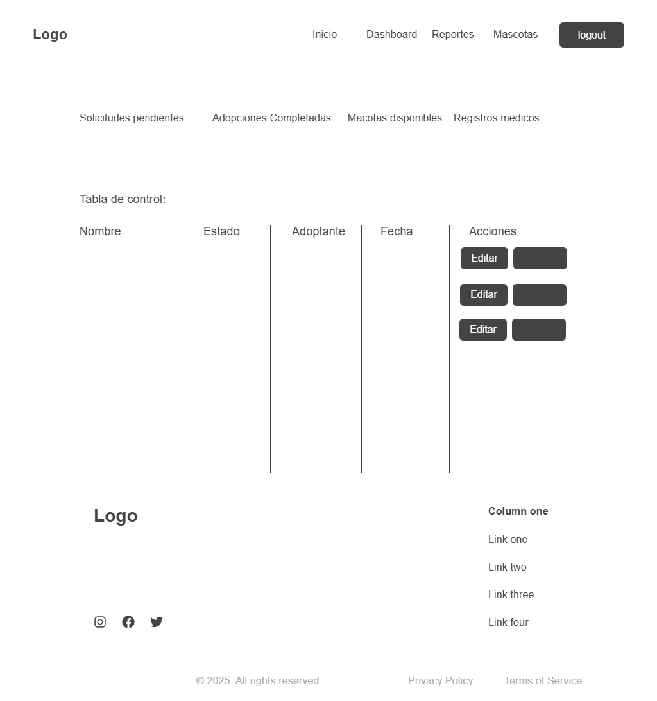
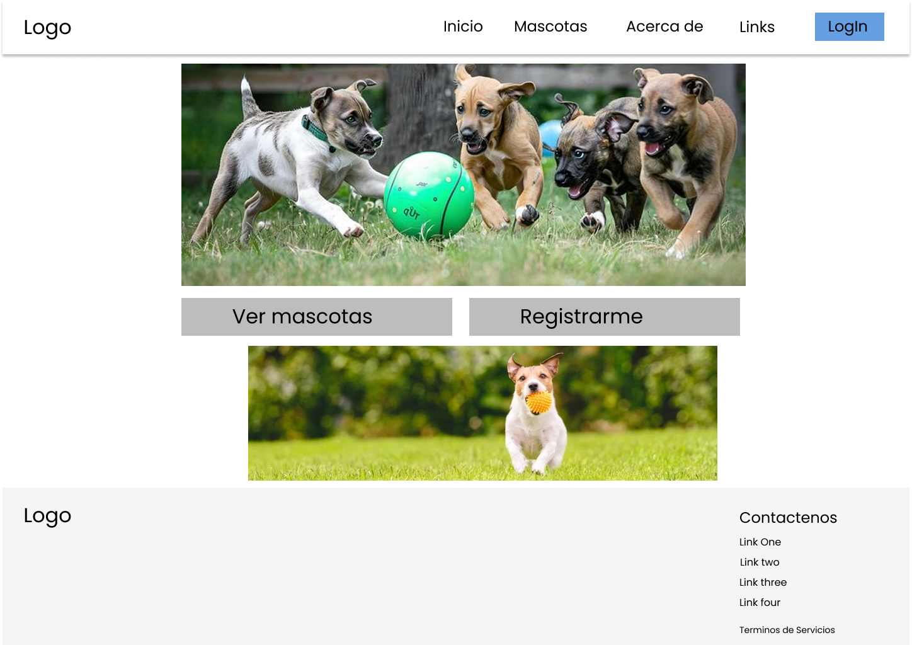
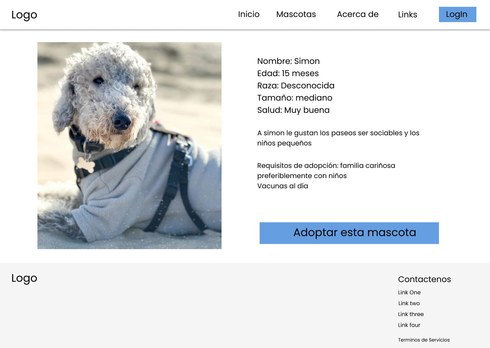
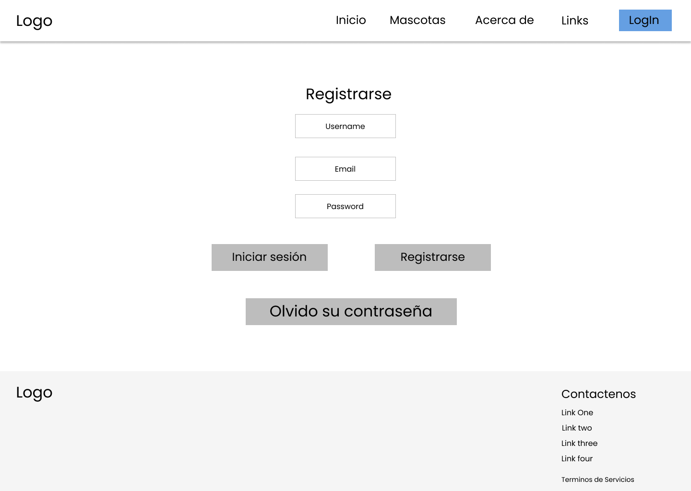

# Plataforma para la gestión de adopción y cuidado de mascotas
Proyecto académico desarrollado para la materia Análisis y Diseño de Sistemas.

## Fases del proyecto
- ## Documentación
- [Actividad 1 – Identificación del proyecto](Documentacion/Actividad1_Identificar_Proyecto.pdf.pdf)
- Diseño y prototipado (Actividad 2)

## 🧱 Prototipos de Baja Fidelidad

Los siguientes wireframes representan la estructura inicial de la plataforma antes del diseño visual final.

### Página de inicio

### Catálogo de mascotas

### Ficha de mascota

### Registro / Login

### Panel administrativo

## 🧱 Prototipos de Alta Fidelidad

Los siguientes wireframes representan la estructura inicial de la plataforma antes del diseño visual final.

### Página de inicio

### Catálogo de mascotas

### Ficha de mascota

### Registro / Login

### Panel administrativo

## Creado por
- William Javier Amaya Castaño
